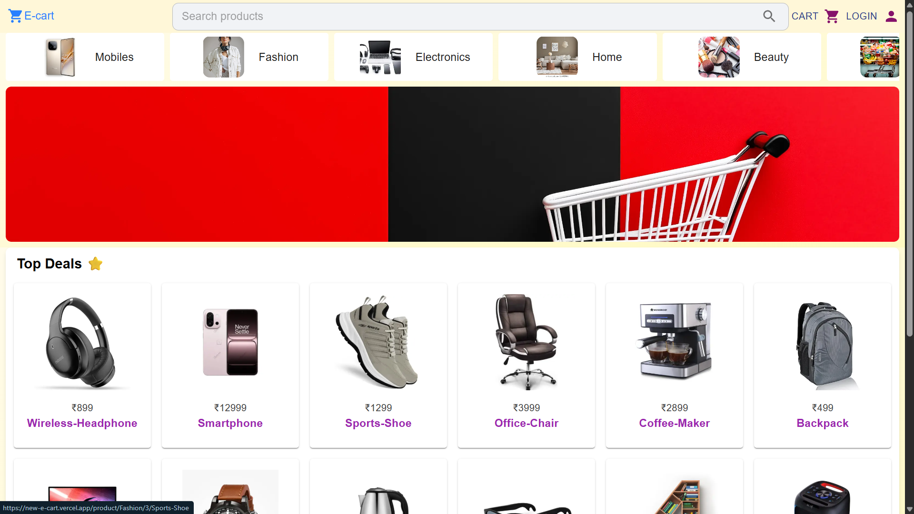
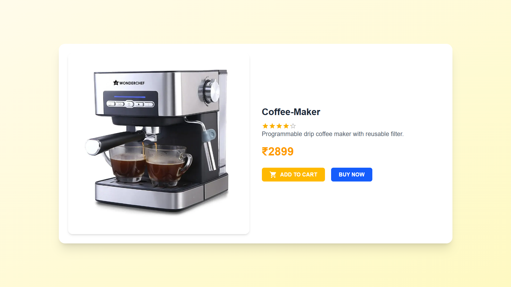
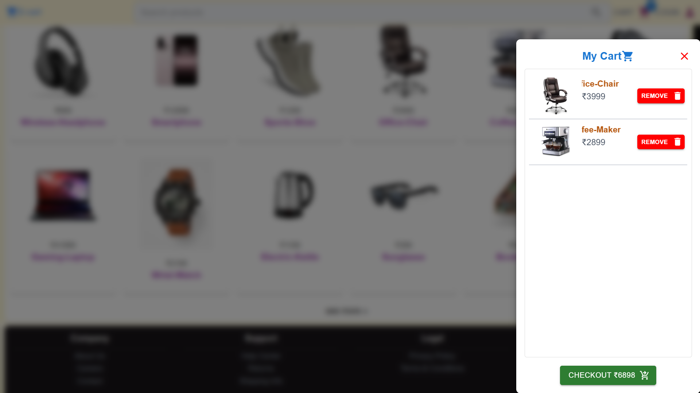
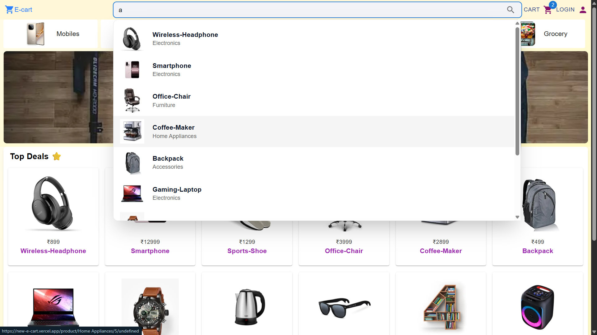

# 🛒 E-Cart | Shopping App

A modern **E-Commerce Web App** built with **Next.js**, offering a smooth shopping experience with dynamic product pages, cart functionality, and a clean responsive UI.  
Built to demonstrate my frontend skills using modern frameworks and practices.

---

## 🚀 Live Demo

🔗 **[View E-Cart App](https://new-e-cart.vercel.app/)**

---

## ✨ Features

- ⚡ **Built with Next.js (App Router)**
- 🧭 **SEO-friendly pages** using `metadata`
- 🛍️ **Dynamic product listing** and details pages
- 🧾 **Add to cart / Remove from cart** functionality
- 💾 **LocalStorage persistence** for cart items
- 📱 **Fully responsive** design
- 🎨 Styled with **TailwindCSS**
- 🔄 **Reusable components** and modular structure
- 🌐 **Deployed on Vercel**

---

## 🏗️ Tech Stack

| Category             | Technologies                 |
| -------------------- | ---------------------------- |
| **Framework**        | Next.js                      |
| **Styling**          | TailwindCSS & Material Ui    |
| **State Management** | useState / Context API       |
| **Data**             | Static JSON / API simulation |
| **Deployment**       | Vercel                       |
| **Version Control**  | Git + GitHub                 |

---

## ⚙️ Setup and Run Locally

```bash
# Clone the repository
git clone https://github.com/Deep-Debnath/New-E-Cart.git

# Navigate to the app directory
cd my-app

# Install dependencies
npm install

# Run the development server
npm run dev
```

Open http://localhost:3000 in your browser.

---

## 📸 Screenshots






---

## 🧑‍💻 Author

**Deep Debnath**  
Frontend Developer • React / Next.js / UI / AI Integration

🌐 [Portfolio](https://my-portfolio-ob9g.vercel.app/)  
💼 [GitHub](https://github.com/Deep-Debnath)
